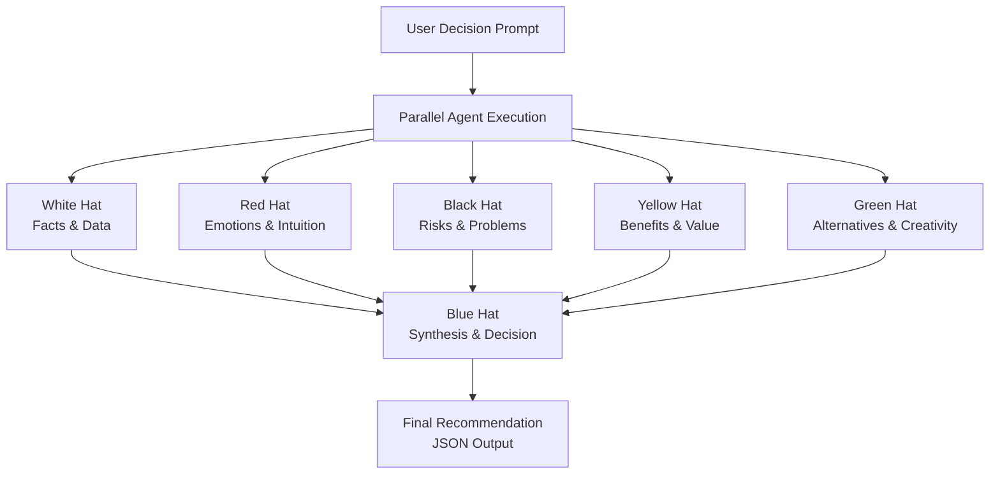

# 6-thinking-caps
https://www.mindtools.com/ajlpp1e/six-thinking-hats/

Multi-agent project to help make decisions
https://www.notion.so/Multi-Agent-Systems-Builder-Day-Guide-2be8ef702b5e80cebf48e0deaa671caa

A system where an LLM uses **control flow** to arrive at a decision given a single prompt.

## Architecture




**Evaluation:**
Implement a parallel workflow where one agent gathers the output of 6 others.


## Prerequisites

1. **Install Ollama** (for local LLM):
   - Download from https://ollama.ai/
   - Run `ollama serve` to start the server

2. **Pull the required model**:
   ```bash
   ollama pull granite4:350m
   ```

## Installation

1. **Clone the repository**:
   ```bash
   git clone https://github.com/arakno/6-thinking-caps.git
   cd 6-thinking-caps
   ```

2. **Install dependencies using uv**:
   ```bash
   uv sync
   uv pip show google-adk
   
   # Install and run in one go
uv sync && uv run python main.py
   ```

## Running the Application

1. **Start the server**:
   ```bash
   uv run python main.py
   ```

2. **Open your browser** and navigate to `http://localhost:8000`

3. **Enter a decision prompt** in the text area and click "Process"

The system will analyze your prompt using 6 Thinking Hats methodology through multiple LLM agents.
