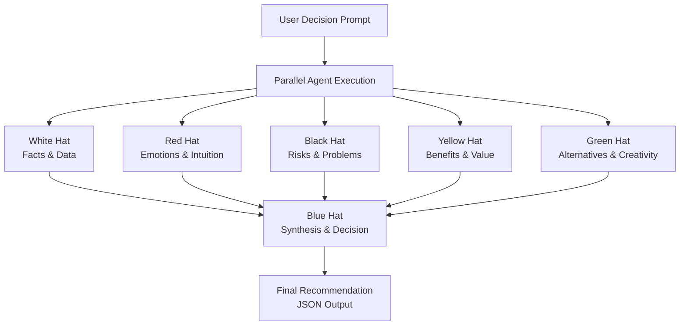

# 6-thinking-caps
https://www.mindtools.com/ajlpp1e/six-thinking-hats/

Multi-agent project to help make decisions

A system where an LLM uses **tools** and **control flow** to arrive at a decision given a single prompt.

## Architecture

**Core ideas to explore:**

1. **Tool Use:** Give the model "hands" (e.g., ability to control a browser, run code, or query an API).
2. **Routing:** Have a "router" step that decides *which* specialized agent should handle a user request.

**Evaluation:**
Implement a parallel workflow where one agent gathers the output of 6 others.
