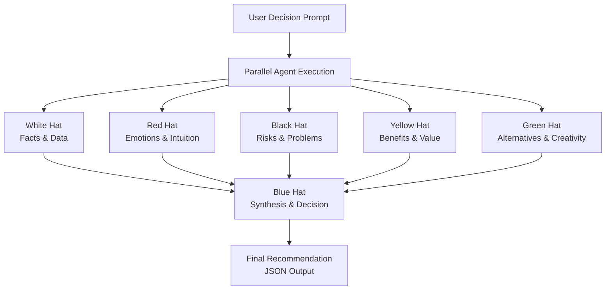

# 6-thinking-caps
https://www.mindtools.com/ajlpp1e/six-thinking-hats/

Multi-agent project to help make decisions
https://www.notion.so/Multi-Agent-Systems-Builder-Day-Guide-2be8ef702b5e80cebf48e0deaa671caa

A system where an LLM uses **control flow** to arrive at a decision given a single prompt.

## Architecture




**Evaluation:**
Implement a parallel workflow where one agent gathers the output of 6 others.


## Prerequisites

1. **Get Gemini API Key**:
   - Visit https://aistudio.google.com/app/apikey
   - Create a new API key
   - Note: Free tier has limited quota

2. **Set up environment**:
   - Create `.env` file in project root
   - Add your API key: `GEMINI_API_KEY=your_api_key_here`

## Installation

1. **Clone the repository**:
   ```bash
   git clone https://github.com/arakno/6-thinking-caps.git
   cd 6-thinking-caps
   ```

2. **Install dependencies using uv**:
   ```bash
   uv sync
   uv pip show google-adk
   ```

3. **Configuration**:
   - Add `GEMINI_API_KEY` to `.env` file

## Running the Application

```bash
# Run with Google ADK (parallel execution)
python3 main.py
```

The system will analyze your prompt using 6 Thinking Hats methodology through multiple LLM agents running in parallel.
